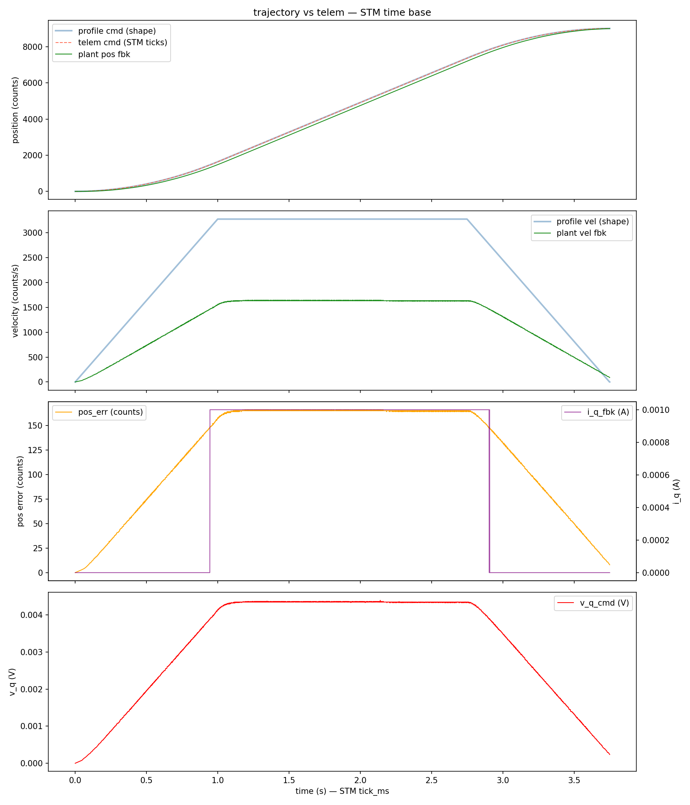
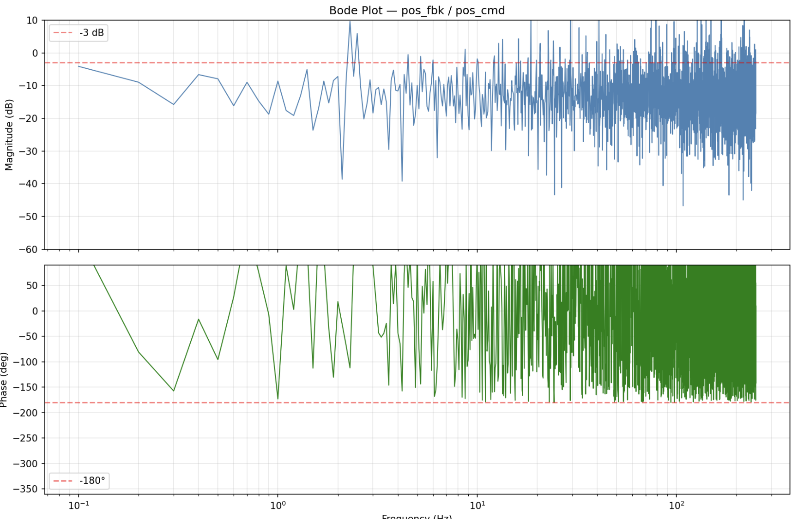

# stm32-servo-drive

Bare metal STM32F446RE servo drive firmware. Closes FOC current, velocity, and position control loops from scratch — no HAL, no RTOS, no commercial drive.

Companion trajectory streamer: [servo-trajectory-streamer](https://github.com/jnzim/servo-trajectory-streamer)

---

## What it does

- Receives trapezoidal trajectory samples from Raspberry Pi over SPI2 + DMA
- Buffers 4096 samples in a ring buffer, asserts PC13 READY for refill at 2048
- Runs three rate-divided control loops in a single hard-RT ISR hierarchy
- Simulated DC motor plant model (see [docs/PLANT_MODEL.md](docs/PLANT_MODEL.md)) for software validation before hardware bring-up
- Streams 32-byte telemetry frames back to Pi on every SPI transaction
- Telemetry includes position command, position feedback, velocity feedback, position error, q-axis current, q-axis voltage, samples consumed
- 3-phase complementary PWM output via TIM1 — DRV8353RS-EVM gate driver

---

## Hardware

- STM32F446RE Nucleo-64
- DRV8353RS-EVM gate driver (15A/20A peak, 9–95V, integrated 3-shunt current sensing)
- Kollmorgen AKM11E-ANCN2-00 BLDC servo motor (N2 option — incremental encoder only)
- 2048 CPR quadrature encoder (TIM5, 4x decode = 8192 counts/rev)
- Raspberry Pi 4/5 as trajectory supervisor via SPI2

---

## Pin Mapping

| Peripheral          | Pins                          | Notes                        |
|---------------------|-------------------------------|------------------------------|
| TIM1 PWM 3-phase    | PA8/PA7, PA9/PB0, PA10/PB1   | Center-aligned complementary |
| TIM5 encoder        | PA0, PA1                      | 32-bit quadrature counter    |
| ADC1 current sense  | PA4, PC1, PC4                 | Triggered at TIM1 peak       |
| SPI1 DRV8353RS      | PA5, PA6, PB5, PB6            | Gate driver config           |
| SPI2 Raspberry Pi   | PB12, PB13, PB14, PB15        | Trajectory + telemetry       |
| PC13 READY          | PC13                          | Active low refill signal     |

---

## Control Loop Architecture

```
Pi → SPI2 → ring buffer (4096 samples)
                  │
             1kHz SysTick
             position loop (P)
                  │ vel_cmd
             5kHz TIM1 ÷4
             velocity loop (PI)
                  │ iq_cmd
             20kHz TIM1
             current loop (PI)
                  │ v_q_cmd
             pwm_apply_vq()
             inverse Park + Clarke
                  │
             TIM1 CH1/2/3 complementary PWM
             DRV8353RS-EVM → AKM11E
```

Dead time inserted automatically by DRV8353RS TDRIVE (VGS monitoring) — not configured in TIM1.

---

## Simulation Results

Software plant model validated before hardware bring-up. See [docs/PLANT_MODEL.md](docs/PLANT_MODEL.md) for derivation.

**Position and velocity tracking — trapezoidal profile:**


**Closed-loop frequency response — chirp sweep 0.1→250Hz:**


Bandwidth ~0.3Hz with P-only position loop and no feedforward — expected for a lightly damped simulation plant with low inertia (`J = 1.7×10⁻⁶ kg·m²`, motor shaft only, no load). Bandwidth will increase significantly on hardware with real motor inertia, tuned gains, and velocity feedforward.

See [docs/PLANT_MODEL.md](docs/PLANT_MODEL.md) for full plant derivation and transfer function.

---

## Build

```bash
cmake -S . -B build \
  -DCMAKE_TOOLCHAIN_FILE=cmake/toolchain.cmake \
  -DCMAKE_BUILD_TYPE=Debug
cmake --build build -j
st-flash --reset write build/fw.bin 0x08000000
```

> **Note:** Build from terminal only. VS Code CMake Tools UI overrides the cross-compile toolchain.

---

## Status

| Component | State |
|---|---|
| SPI2 slave DMA circular | ✅ proven — 5007 packets, 0 errors |
| Ring buffer + READY refill | ✅ proven |
| TIM1 20kHz ISR | ✅ running |
| Drive state machine | ✅ IDLE → ENABLED → IDLE |
| Plant model simulation | ✅ loops closed, gain tuning in progress |
| TIM1 3-phase complementary PWM | ✅ verified on scope at 20kHz |
| FOC inverse Park + Clarke | ✅ implemented in pwm_apply_vq() |
| ADC current sensing | 🔲 not yet wired |
| Encoder hardware bring-up | 🔲 cable needed |
| Open loop motor spin | 🔲 pending hardware wiring |
| Closed loop FOC | 🔲 pending hardware bring-up |

---

## Project Goal

Demonstrate full-stack servo drive competency — trajectory generation, SPI comms, bare metal STM32, and closed-loop FOC from scratch. Target applications: semiconductor capital equipment (KLA, ASML, Aerotech, Lam Research).
